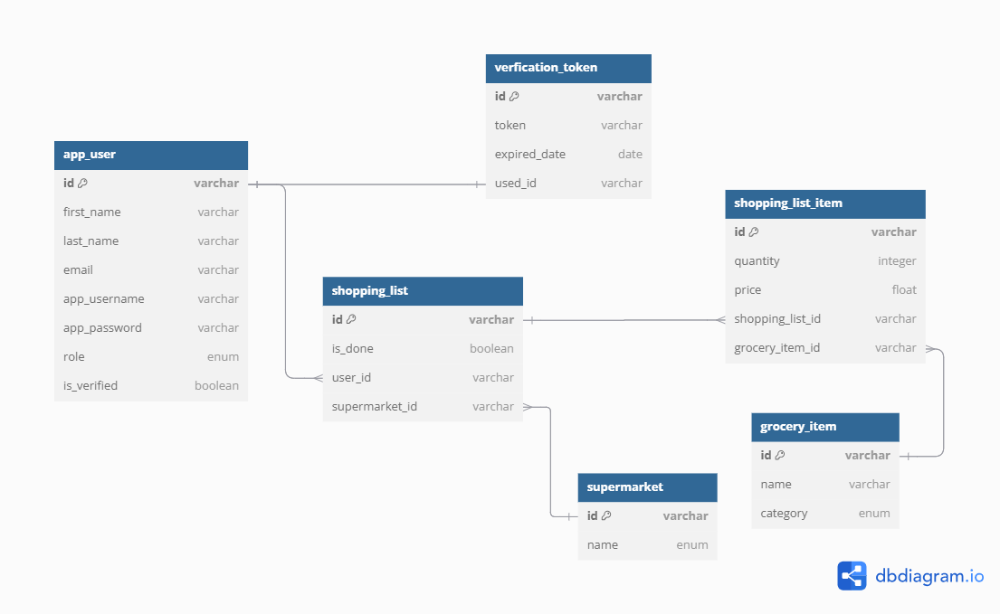

## Groceries shopping RESTful API with auth

This application is designed to expose a set of RESTful endpoints to manage grocery shopping, It serves as the backend
component for other web or mobile applications. It uses Spring Security with JWT for authorisation and authentication.

### Database schema

The database schema from **dbdiagramm.io**

```
Table app_user {
  id integer [primary key]
  first_name varchar
  last_name varchar
  email varchar
  app_username varchar
  app_password hash
  role enum
  is_verified boolean
}

Table verification_token {
  id integer [primary key]
  token varchar
  expiry_date date
  user_id int [ref: - app_user.id]
}

Table shopping_list {
  id integer [primary key]
  is_done bool
  user_id int [ref: > app_user.id]
  supermarket_id int [ref: > supermarket.id]
}

Table supermarket {
  id integer [primary key]
  name enum
}

Table shopping_list_item {
  id integer [primary key]
  quantity int
  price float
  shopping_list_id int [ref: > shopping_list.id]
  grocery_item_id int [ref: > grocery_item.id]
}

Table grocery_item {
  id integer [primary key]
  name varchar
  category enum
}
```

#### The db schema diagramm



### Terminal dev environment commands

```
docker network create postgres_db

mkdir db-data

cd db-data

docker run --name postgres -p 5432:5432 --network=postgres -v "${PWD}:/var/lib/postgresql/data" -e POSTGRES_PASSWORD=postgres -d postgres:alpine

docker ps

ls -la

docker run -it --rm --network=postgres postgres:alpine psql -h postgres -U postgres

\l

CREATE DATABASE groceries;
 ```

### Code generation

Before starting the project run the following command in the terminal:

```
./gradlew clean build openApiGenerate
```

Or just run:

```
./gradlew openApiGenerate
```

### Swagger UI

http://localhost:9000/api/swagger-ui/index.html

### Insert statements for supermarkets
```
INSERT INTO supermarket (id, name) values (1, 'BILLA');
INSERT INTO supermarket (id, name) values (2, 'SPAR');
INSERT INTO supermarket (id, name) values (3, 'LIDL');
INSERT INTO supermarket (id, name) values (4, 'HOFER');
INSERT INTO supermarket (id, name) values (5, 'ETSAN');
INSERT INTO supermarket (id, name) values (6, 'OTHER');
```